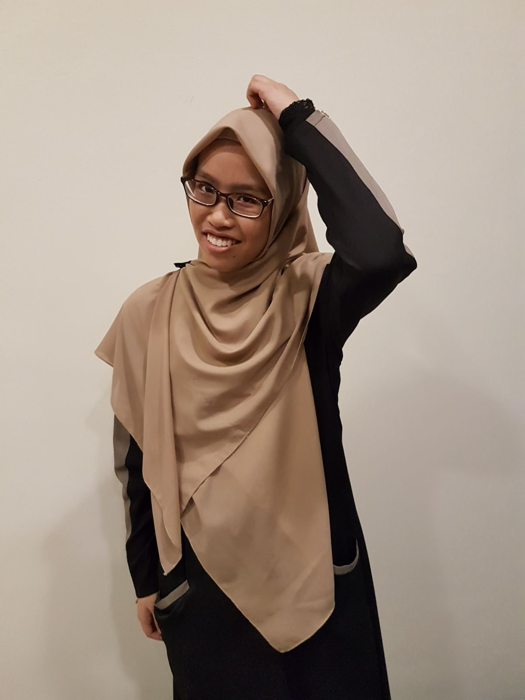

# About Me

## Who Am I?

Hi, this is a short intro about myself.

My name is Nur 'Arifah binte Mohd Shahri. You can call me Arifah. Im from the school of Electrical and Electronic Engineering (triple E for short). And I'm from class DEEE/24.

I chose EEE as my course because I love learning about how things work. Especially new techs. Thus, why engineering. And in between the Mechanical and Elecrical, I opt for electrical  

